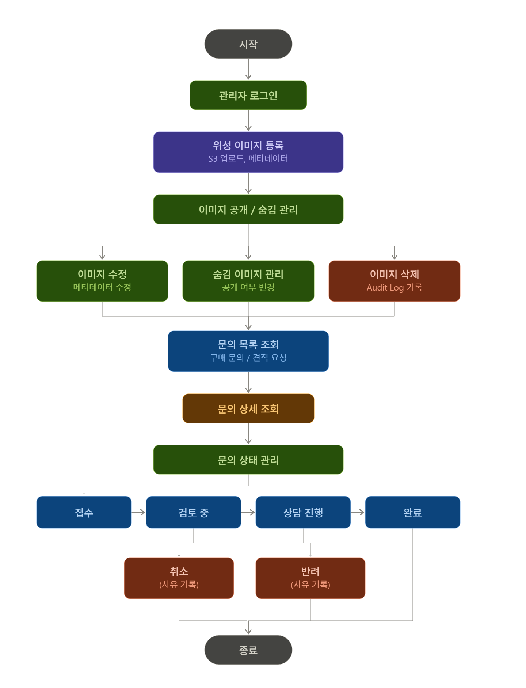
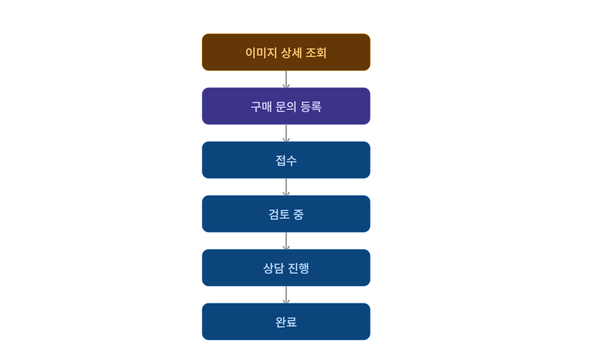
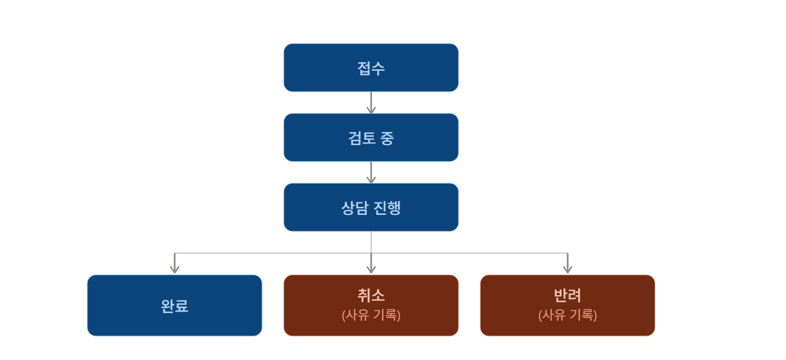

# 사용자 흐름도

> **문서 버전:** v1.0  
> **프로젝트명:** SatelliteView  
> **작성자:** 임하은  
> **작성일:** 2026-07-26

---

# 1. 문서 목적

본 문서는 SatelliteView 서비스에서 **사용자(User)**와 **관리자(Admin)**가 서비스를 이용하는 전체 흐름을 정의한다.

서비스 이용 과정을 시각적으로 표현하여 기능 간의 관계를 이해하고, 이후 작성될 기능 명세서, ERD, API 명세서의 기준 문서로 활용한다.

---

# 2. 일반 사용자(User) 흐름

사용자는 회원가입 후 로그인하여 위성 이미지를 탐색하고, 원하는 이미지에 대해 구매 문의 또는 견적 요청을 등록할 수 있다.

---

# 3. 관리자(Admin) 흐름

관리자는 위성 이미지를 등록하고 메타데이터를 관리하며, 사용자 문의를 처리한다.

---

# 4. 주요 비즈니스 흐름

## 4.1 메타데이터 기반 검색

SatelliteView의 핵심 기능은 단순 이미지 조회가 아니라 메타데이터를 활용한 조건 검색이다.

사용자는 다음과 같은 조건을 자유롭게 조합하여 검색할 수 있다.

- 지역
- 촬영일
- 해상도
- 구름량
- 태그

검색 결과는 조건에 맞는 위성 이미지 목록으로 제공되며, 사용자는 원하는 이미지를 선택하여 상세 정보를 확인할 수 있다.

---

## 4.2 구매 문의

사용자는 이미지 상세 화면에서 현재 선택한 위성 이미지에 대한 구매 문의를 등록할 수 있다.

구매 문의 등록 후 관리자가 문의를 확인하며, 상태 변경을 통해 상담이 진행된다.

---

## 4.3 견적 요청

등록된 이미지 외에 원하는 조건의 위성 이미지가 필요한 경우 견적 요청을 등록할 수 있다.

예를 들어 다음과 같은 요청이 가능하다.

- 특정 지역의 신규 촬영 이미지
- 원하는 해상도의 이미지
- 특정 촬영일의 이미지

---

## 4.4 관리자 문의 처리

관리자는 구매 문의와 견적 요청을 각각 관리하며 진행 상태를 변경한다.

문의 상태는 다음과 같이 관리된다.

문의 처리 상태를 통해 사용자는 자신의 문의 진행 상황을 확인할 수 있다.

---

# 5. 문서 활용

본 문서는 다음 문서의 기준 자료로 활용한다.

- 기능 명세서
- ERD
- API 명세서
- 시스템 아키텍처

기능 명세서는 본 문서의 사용자 및 관리자 흐름을 기준으로 각 기능의 상세 동작을 정의한다.
ERD와 API 명세서는 본 문서에서 정의한 흐름을 기반으로 데이터 구조와 기능 인터페이스를 설계한다.